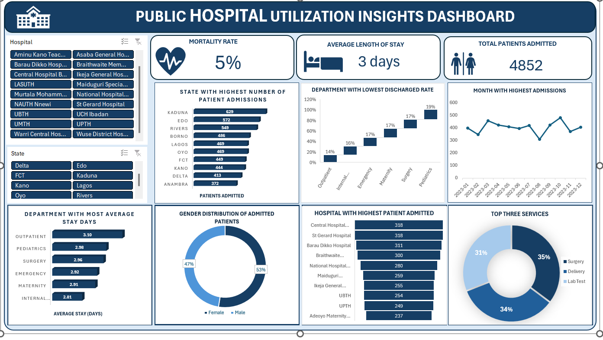

# Public-Hospital-Utilization-Analysis

### Project Overview 
An interactive Excel dashboard that analyzes public hospital utilization using Pivot Tables, Pivot Charts, KPI cards, and Slicers. It provides insights into patient admissions, discharges, mortality, and hospital performance while showcasing data analysis, visualization, and dashboard design skills.

### Data Source
The Primary dataset used for this analysis is the "Public Hospital Utilization Dataset-Excel" file,containing hospital records, including patient admissions, discharges, mortality, average length of stay, departments, services, gender, and state information used to analyze hospital performance and healthcare utilization.

### Tools
- Excel
 - Data Cleaning
 - Pivot Table

### Dasboard Preview

### Data Cleaning

During the initial data preparation phase, the following tasks were performed:
- Removed duplicate records.
 -Checked for missing values.
 -Standardized data formatting.
 -Created calculated fields where needed.

### Exploratory Data Analysis 

EDA focused on exploring the dataset to identify key trends, including:
- Admissions and discharges by state.
 - Mortality trends.
 - Average length of stay.
 - Department and service performance.
 - Gender distribution.

### Key Performance Indicators
- Total Patients Admitted
 - Total Patients Discharged
 - Total Mortality Count
 - Average Length of Stay
 - Admission-to-Discharge Rate

### Visualization
- KPI Cards
 - Column Charts
 - Bar Charts
 - Pie Chart
 - Slicers

### Results/Findings
- Patient demand was highest in the Pediatrics and Maternity departments.
 - Emergency and Surgery recorded the highest mortality rates.
 - Length of stay varied across services, indicating differences in operational efficiency.
 - Discharge performance differed across hospitals, with some maintaining more consistent patient turnover.

### Challenges
- Cleaning inconsistent data entries.
 - Organizing the data for accurate analysis.
 - Designing a dashboard that was both interactive and easy to understand.

### Recommendations
- Focus resources on high-demand hospitals.
 - Monitor departments with longer patient stays and higher mortality rates.
 - Use dashboard insights to support planning and decision-making.
